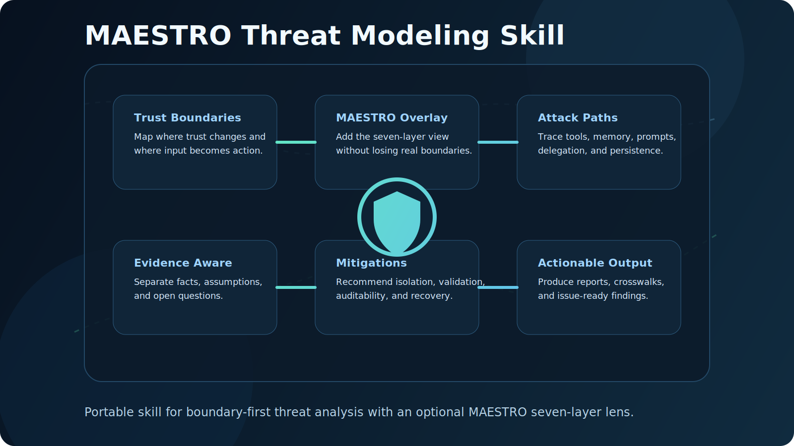

# MAESTRO Threat Modeling — Canonical

[](LICENSE)
[](https://github.com/kiosvantra/maestro-threat-modeling-skill/releases)
[](https://github.com/kiosvantra/maestro-threat-modeling-skill/stargazers)

<p align="center">
  
</p>

The canonical public skill for threat modeling with **boundary-first analysis** and a **MAESTRO overlay**.

## What changed in v2

This repository now publishes the **canonical** version of the skill.

It replaces the older generic formulation with a stronger workflow that is:
- still portable and public
- explicitly evidence-first
- boundary-first by default
- MAESTRO-aligned without becoming rigid
- better for repo-first reviews, CISO reviews, and GitHub-target assessments

## Core stance

- **Boundary-first** is the default analysis mode.
- **MAESTRO** is used as an overlay when it improves clarity or comparability.
- Findings must separate **facts**, **inferences**, and **assumptions**.
- Repo assessments must be labeled **repo-first** unless runtime evidence was inspected.

## Best-fit use cases

- repository threat modeling
- CISO repo reviews
- agentic / multi-agent systems
- RAG pipelines
- MCP / tool-calling systems
- deployment and CI/CD reviews
- GitHub-target risk reviews

## Output shape

The canonical skill requires this order:
1. Scope and intent
2. System snapshot
3. Trust boundaries
4. Assumptions and blind spots
5. MAESTRO layer findings
6. Top threats
7. Mitigations
8. Execution backlog

## Repository layout

```text
.
├── SKILL.md
├── README.md
├── LICENSE
└── assets/
    ├── maestro-threat-modeling-skill.svg
    ├── obsidian-note-template.md
    └── technical-report-template.md
```

## Included artifacts

- `SKILL.md` — canonical public skill
- `assets/obsidian-note-template.md` — short note template for knowledge bases
- `assets/technical-report-template.md` — fuller report template for technical reviews

## Quick start

```bash
git clone https://github.com/kiosvantra/maestro-threat-modeling-skill.git
cd maestro-threat-modeling-skill
```

Copy `SKILL.md` into your agent skill directory or adapt it into your prompt system.

## Example prompt wrapper

```text
Use the attached MAESTRO Threat Modeling canonical skill.
Default to boundary-first analysis.
Use MAESTRO layers only as an overlay when they improve clarity.
Separate facts, inferences, and assumptions.
End with top threats, mitigations, and an execution backlog.
```

## Portability notes

This public version intentionally avoids mandatory references to:
- private file paths
- proprietary retrieval systems
- local-only helper scripts
- a specific memory backend

## Method fit

This is not a scanner and not a full runtime audit by itself.
It is strongest when used to produce an evidence-based threat model from:
- code
- configs
- workflows
- prompts
- manifests
- docs
- issue history

## License

MIT
